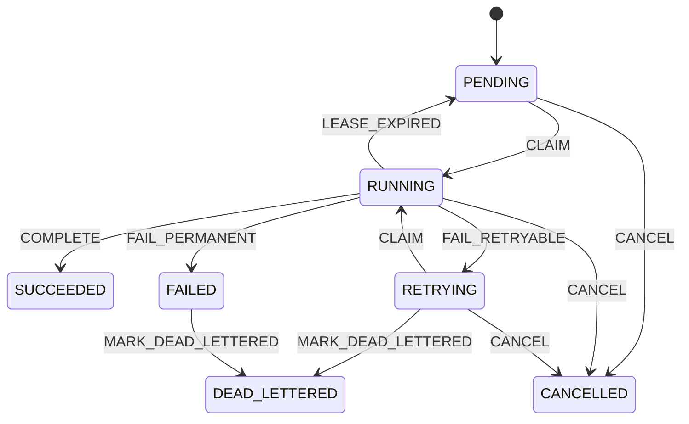

# Architecture

Orchestrator is a durable execution engine built around explicit state transitions rather than best-effort queue consumption.

## Core Components

- API server: accepts workflow and job submissions, cancellations, and status queries.
- Scheduler: finds runnable work and assigns leases to eligible workers.
- Worker: executes leased tasks, renews leases, emits heartbeats, and reports completion or failure.
- State store: persists workflows, jobs, attempts, leases, idempotency keys, and worker heartbeats.
- Observability: exposes metrics for queue depth, job latency, retry counts, lease expiry, and worker liveness.

## First State Model

Jobs begin in `PENDING`, move to `RUNNING` when leased by a worker, and finish as `SUCCEEDED`, `FAILED`, `CANCELLED`, or `DEAD_LETTERED`.

Retries are represented explicitly: a failed attempt can schedule the job back to `RETRYING` with a future `next_run_at`. When that time arrives, the scheduler can move it back to `PENDING`.

## Reliability Rules

- A worker owns a job only until `lease_expires_at`.
- Completion reports must include the assignment version that granted the lease.
- Stale workers cannot complete work after a newer assignment version exists.
- Client idempotency keys map duplicate submissions to the original job.
- State transitions are validated in the domain layer before persistence.

## ML Demo Workloads

The orchestrator itself is general-purpose. The demos will focus on infrastructure-shaped ML jobs:

- batch document ingestion
- embedding generation over document chunks
- batch inference over an input manifest
- model evaluation over a fixed dataset
- index rebuild and merge
